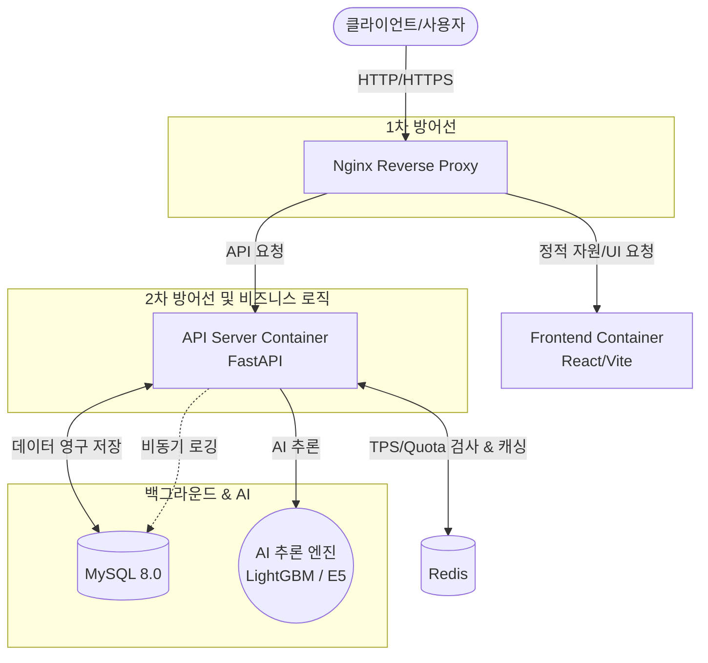

# Malicious Prompt Detection System Architecture

본 문서는 B2B 악성 프롬프트 탐지 SaaS 프로젝트의 계층별 소프트웨어 아키텍처(Software Architecture)와 시스템 아키텍처(System Architecture)에 대한 표준 산출물 명세입니다.

---

## 1. 소프트웨어 아키텍처 (Layered Architecture)

백엔드 서버(FastAPI)는 도메인 주도 설계(DDD)를 참고한 엄격한 **계층형 아키텍처(Strict Layering)** 구조를 따릅니다. 각 계층은 단방향 의존성을 가지며, 관심사를 분리하여 유지보수성과 확장성을 높입니다.

### 1.1 API Layer (`app/api`)
- **역할:** 클라이언트의 HTTP 요청을 가장 먼저 접수하고 응답을 반환하는 계층입니다.
- **주요 기능:** 
  - FastAPI 라우팅 (엔드포인트 정의)
  - Pydantic 모델을 활용한 Request/Response 스키마 데이터 유효성 검증
  - 인증 토큰 검사(Dependency Injection)
- **주요 모듈:** `endpoints.py` (사용자 인증, API 키 발급, 분석 API 등)

### 1.2 Service Layer (`app/services`)
- **역할:** 시스템의 핵심 비즈니스 로직을 수행하고 트랜잭션을 관리하는 계층입니다.
- **주요 기능:**
  - API 계층에서 넘겨받은 데이터를 가공하여 비즈니스 규칙 적용
  - DB 데이터 조작을 위해 Repository 계층 호출
  - AI 모델 추론, API Key 검증, Rate Limiting 등의 핵심 워크플로우 통제
- **주요 모듈:** `logic.py` (AuthService, AnalyzeService, APIKeyManagementService 등)

### 1.3 Repository Layer (`app/repositories`)
- **역할:** 데이터베이스와의 직접적인 I/O를 전담하는 계층입니다.
- **주요 기능:**
  - SQLAlchemy 2.0 (Async)을 이용한 ORM 쿼리 작성 및 실행
  - 비즈니스 로직이 DB 기술에 종속되지 않도록 인터페이스 제공
- **주요 모듈:** `base.py` (UserRepository, APIKeyRepository, LogRepository 등)

### 1.4 Core Layer (`app/core`)
- **역할:** 애플리케이션 전반에서 공통으로 사용되는 핵심 설정, 보안, 인프라 연동 객체를 관리합니다.
- **주요 기능:**
  - **보안:** JWT 토큰 발급/검증, 비밀번호 해싱 (Bcrypt)
  - **인프라 연결:** 데이터베이스(MySQL) 및 Redis 세션 관리
  - **AI 코어:** AI 모델 객체의 메모리 로드 및 추론 엔진 (Singleton 패턴 적용)
  - **제한:** Rate Limiter 엔진 로직
- **주요 모듈:** `security.py`, `database.py`, `ai_core.py`, `rate_limit.py`

---

## 2. 시스템 아키텍처 (System Architecture)

전체 시스템은 고가용성과 대규모 트래픽 처리를 위한 다층 방어(Defense in Depth) 전략 기반의 마이크로서비스 형태(Docker Compose)로 구성되어 있습니다.

### 2.1 주요 컴포넌트 역할

1. **Nginx (Reverse Proxy & 1차 방어선)**
   - 외부 트래픽이 시스템으로 진입하는 단일 진입점입니다.
   - 프론트엔드와 백엔드 API로 요청을 라우팅합니다.
   - `limit_req_zone` 등을 활용하여 IP 기반의 원초적인 트래픽 제한 및 어뷰징 1차 방어 역할을 수행합니다.

2. **Frontend (React)**
   - 사용자에게 대시보드 및 악성 프롬프트 탐지 테스트 환경(UI)을 제공합니다.

3. **API Server (FastAPI)**
   - 시스템의 메인 백엔드 서버입니다.
   - API Key 유효성 검증, 데이터베이스 조회, 비즈니스 로직 처리, 백그라운드 태스크(비동기 로깅 등) 처리를 담당합니다.
   - **AI Core 통합:** 파이썬 환경의 이점을 살려 API 서버 내부에 `intfloat/multilingual-e5` 모델과 LightGBM 추론 엔진을 메모리에 로드(싱글톤)하여 고속으로 프롬프트 위협을 분석합니다.

4. **Redis (2차 방어선 & 인메모리 캐시)**
   - 발급된 API Key 정보를 캐싱하여 빠른 인증 처리를 돕습니다.
   - API 요청마다 유저의 `daily_quota`와 `tps_limit`을 카운팅하고 검증하는 비즈니스 레벨의 Rate Limiting을 수행합니다.

5. **MySQL (데이터베이스)**
   - 사용자 정보(Users), API 발급 키 정보(API Keys), 그리고 프롬프트 분석 결과 내역(Detection Logs)을 영구적으로 저장하고 관리합니다.
