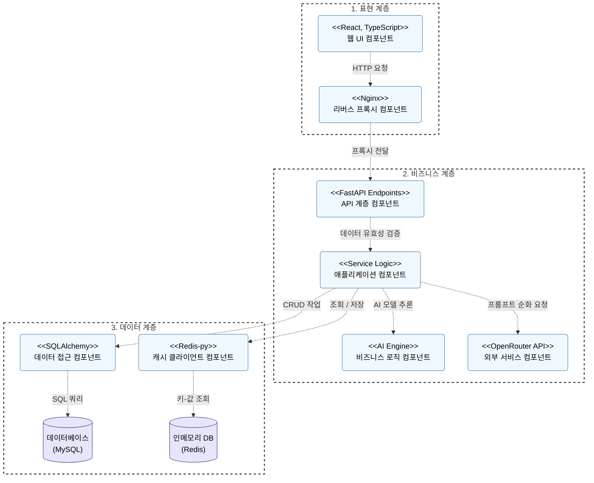

# 2.5 아키텍처 설계서

## ▣ 제·개정 이력

| 날짜 | 버전 | 작성자 | 승인자 | 내용 |
| :--- | :---: | :--- | :--- | :--- |
| 2026.06.06 | 1.0 | AI 어시스턴트 | 발주자 | 아키텍처 설계서 최초 작성 (CBD 표준 산출물 양식 적용) |

---

## D5 아키텍처 설계서

| 시스템명 | 악성 프롬프트 탐지 SaaS | 서브시스템명 | 통합관리 시스템 |
| :--- | :--- | :--- | :--- |
| **단계명** | 설계 | **작성일자** | 2026.06.06 | **버전** | 1.0 |

---

### 1. 소프트웨어 아키텍처

백엔드 서버(FastAPI)는 관심사의 분리와 유지보수성 향상을 위해 **엄격한 계층형 아키텍처(Strict Layering)**를 채택하였으며, 도메인 주도 설계(DDD) 패턴을 참고하여 하위 계층으로의 단방향 의존성만을 허용합니다.



* **API Layer (`app/api/endpoints.py`)**
  * 클라이언트의 HTTP/HTTPS 요청 접수 및 FastAPI 라우팅
  * Pydantic 스키마를 활용한 Request/Response 데이터 유효성 검증
* **Service Layer (`app/services/logic.py`)**
  * 시스템의 핵심 비즈니스 로직 캡슐화 및 트랜잭션 관리
  * AI 모델 추론, API Key 검증, Rate Limiting 등의 핵심 워크플로우 통제
* **Repository Layer (`app/repositories/base.py`)**
  * 데이터베이스(MySQL)와의 직접적인 I/O 전담
  * SQLAlchemy 2.0 (Async)을 이용한 비동기 ORM 쿼리 작성 및 실행
* **Core Layer (`app/core/`)**
  * 애플리케이션 전반에서 공통으로 사용되는 핵심 설정 및 인프라 연동 객체 관리
  * 보안(`security.py`), DB/Redis 인프라 연결(`database.py`), Rate Limiter(`rate_limit.py`)
  * AI 코어(`ai_core.py`): AI 모델 객체의 메모리 로드 및 추론 엔진 연동

---

### 2. 시스템 아키텍처

전체 시스템은 고가용성 및 대규모 트래픽 처리를 위한 다층 방어(Defense in Depth) 전략 기반의 컨테이너(Docker) 마이크로서비스 형태로 구성되어 있습니다. 아래는 B2B 클라이언트 요청부터 AI 기반 탐지 및 순화 루프에 이르는 시스템 전체의 작동 흐름도입니다.

```mermaid
flowchart TD
    %% 스타일 정의
    classDef external fill:#f9f9f9,stroke:#999,stroke-width:1px,stroke-dasharray: 5 5;
    classDef proxy fill:#fff3e0,stroke:#ff9800,stroke-width:1px,color:#000,rx:5px,ry:5px;
    classDef backend fill:#e3f2fd,stroke:#2196f3,stroke-width:1px,color:#000,rx:5px,ry:5px;
    classDef db fill:#e8f5e9,stroke:#4caf50,stroke-width:1px,color:#000;
    classDef ai fill:#f3e5f5,stroke:#9c27b0,stroke-width:1px,color:#000,rx:5px,ry:5px;
    classDef layerBox fill:transparent,stroke:#555,stroke-dasharray: 5 5,stroke-width:2px;

    %% -------------------------
    %% 1. 외부 사용자 (External Zone)
    %% -------------------------
    subgraph External [외부망 접속]
        direction LR
        Client([B2B 클라이언트]):::external
        Admin([대시보드 관리자]):::external
    end

    %% -------------------------
    %% 2. 프록시 & 프론트엔드 (DMZ)
    %% -------------------------
    subgraph DMZ [프록시 및 웹 서버 계층]
        direction LR
        Nginx["Nginx Reverse Proxy<br/>(1차 IP 트래픽 방어)"]:::proxy
        Frontend["Frontend Container<br/>(React / Vite)"]:::proxy
    end

    %% -------------------------
    %% 3. 메인 백엔드 로직
    %% -------------------------
    subgraph Backend [메인 비즈니스 계층]
        APIServer["FastAPI Server<br/>(2차 방어선 및 로직 오케스트레이션)"]:::backend
    end

    %% -------------------------
    %% 4. 내부 인프라 & AI 코어
    %% -------------------------
    subgraph Infra [데이터베이스 및 AI 인프라]
        direction LR
        Redis[("Redis Cache<br/>(TPS/Quota 검증)")]:::db
        AICore(("AI 추론 엔진<br/>(LightGBM / E5)")):::ai
        DB[("MySQL 8.0<br/>(로그 비동기 저장)")]:::db
    end
    
    OpenRouter(["OpenRouter API<br/>(LLM 프롬프트 순화)"]):::external

    %% -------------------------
    %% 연결선 및 데이터 흐름
    %% -------------------------
    Client -->|1. 프롬프트 API 요청| Nginx
    Admin -->|UI 페이지 접속| Nginx
    
    Nginx -->|라우팅| APIServer
    Nginx -.->|정적 파일 제공| Frontend
    
    APIServer <-->|2. API Key 및 할당량(Quota) 검증| Redis
    APIServer -->|3. 텍스트 위협 분석 요청| AICore
    AICore -->|4. 악성 여부 및 분석 결과 반환| APIServer
    
    APIServer -->|5. 악성 탐지 시 LLM 순화 요청| OpenRouter
    OpenRouter -->|6. 문맥이 보존된 순화 텍스트| APIServer
    APIServer -.->|7. 순화된 문장 재검증 반복 (Self-Correction)| AICore
    
    APIServer -->|8. 최종 안전한 프롬프트 반환| Client
    APIServer -.->|9. Background 비동기 저장| DB

    %% 서브그래프 테두리 스타일 지정
    class External,DMZ,Backend,Infra layerBox;
```

* **Nginx (Reverse Proxy)**: 1차 방어선. 외부 트래픽 진입점. IP 기반 `limit_req_zone`을 활용한 원초적 트래픽 제한 및 어뷰징 방어.
* **Frontend (React/Vite)**: 관리자용 대시보드 및 악성 프롬프트 테스트 환경 제공.
* **API Server (FastAPI)**: 메인 비즈니스 서버. 2차 방어선 역할. 인증(JWT), 데이터베이스 조회, 비즈니스 로직 및 백그라운드 태스크 처리.
* **Redis**: 2차 방어선(인메모리 캐시). API Key 정보 캐싱 및 API Key별 TPS / 일일 할당량(Daily Quota) 차감.
* **MySQL**: 데이터 영구 보존소. 사용자 정보, API Key 정보, 탐지/순화 로그(Detection Logs) 저장.
* **AI Core (backend/)**: 메모리에 상주하는 2단계 프롬프트 위협 분석 엔진 (LightGBM + E5 모델).

---

### 3. 아키텍처 요구사항 및 구현방안

| 요구사항 ID | SS_REQ_010 |
| :--- | :--- |
| **요구사항 내용** | 시스템의 안정적인 트래픽 제어 및 어뷰징(DDoS, 과다요청) 방어 체계 구축 |
| **구현방안** | **투 트랙(Two-Track) 다층 방어 체계 적용**<br>1. **네트워크/프록시 레벨 (Nginx)**: IP 단위의 원초적인 요청 제한(`limit_req_zone`)으로 악의적 트래픽 1차 차단.<br>2. **비즈니스 로직 레벨 (Redis + FastAPI)**: 인증된 B2B 고객의 API Key를 기준으로 TPS(초당 요청 수)와 Daily Quota(일일 할당량)를 실시간 카운팅하여 한도 초과 시 즉시 429 Too Many Requests 에러 반환. |

<br>

| 요구사항 ID | SS_REQ_020 |
| :--- | :--- |
| **요구사항 내용** | 지연 시간이 없는 고속 AI 프롬프트 위협 탐지 및 응답 제공 |
| **구현방안** | **AI 모델 싱글톤(Singleton) 프리로드 및 비동기(Async) 처리**<br>1. FastAPI 서버 기동 시 `intfloat/multilingual-e5` 임베딩 모델과 LightGBM 추론 엔진을 메모리에 즉시 로드(Singleton)하여 매 요청 시 모델 로딩 비용 제거.<br>2. 로깅 및 분석 내역 저장은 FastAPI의 `BackgroundTasks`를 활용하여 비동기로 데이터베이스에 인서트함으로써 API 응답 지연을 방지함. |

<br>

| 요구사항 ID | SS_REQ_030 |
| :--- | :--- |
| **요구사항 내용** | 단순 차단이 아닌 문맥을 유지한 프롬프트 자동 순화 및 검증 로직 확보 |
| **구현방안** | **LLM 외부 연동 및 자가 피드백 루프(Self-Correction Loop) 구축**<br>1. 위험이 탐지된 프롬프트는 OpenRouter API를 통해 LLM으로 전송되어 공격성이 제거된 단어로 순화(Sanitization) 처리됨.<br>2. 순화된 결과물은 다시 자체 AI 모델 엔진으로 입력되어 안전성 여부를 재평가함.<br>3. 재평가에 실패할 경우, LLM에 피드백을 담아 재수정을 지시하는 검증 루프를 최대 5회 반복 수행하여 최종적으로 가장 안전하고 문맥이 보존된 결과를 반환함. |
